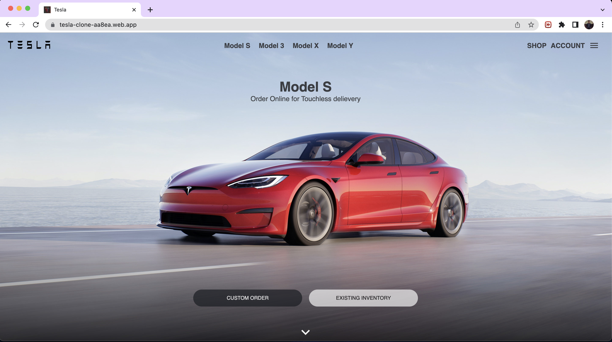
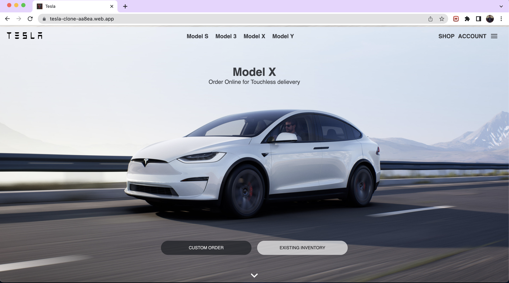
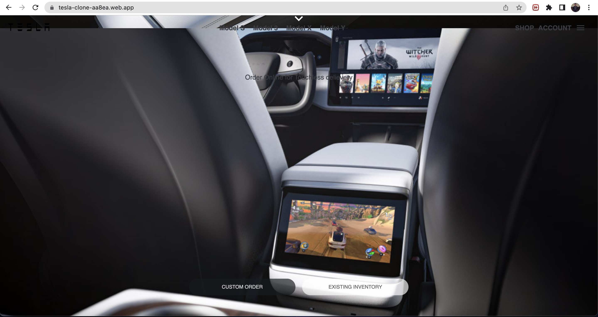

# Tesla Website Front-end Clone

Welcome to this repository containing a front-end clone of the Tesla website, built using HTML, CSS, JavaScript and ReactJs.

Please note that this website is for educational purposes only and is intended to be used as a portfolio piece. It is not intended for commercial or monetary gain and is not affiliated with Tesla.

# Installation

1. Clone the repository
2. Navigate to the folder in VS code
3. Run npm install
4. Run npm start 🎬
5. Ready to launch 🚀!

# Link

https://tesla-clone-aa8ea.web.app/

# Libraries/Technologies used

# Screenshots

